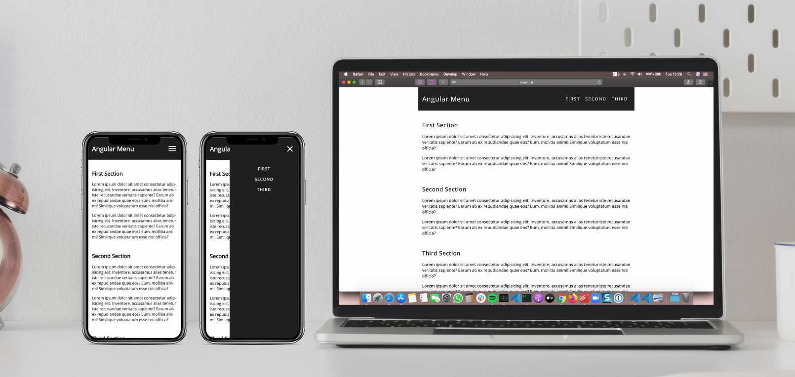

# Angular Responsive Menu

This project was generated with [Angular CLI](https://github.com/angular/angular-cli) version 9.1.7, and contains a code example of a responsive and accessible menu with just CSS and TypeScript (without CSS libraries).

## Requirements

You must have the following application installed:

- [NodeJS 12+](https://nodejs.org/en/)

## Running the application

1. Clone this repository.
2. Run `$ npm install` to install all the dependencies.
3. Run `$ ng serve` for a dev server. Navigate to `http://localhost:4200/`. The app will automatically reload if you change any of the source files.

## Troubleshooting

If you had any problem trying to run the application make sure that you have met the following requirements:

```
Node version: v12.8.0
Npm version: v6.14.5
```

## The project

Mobile and desktop version:


